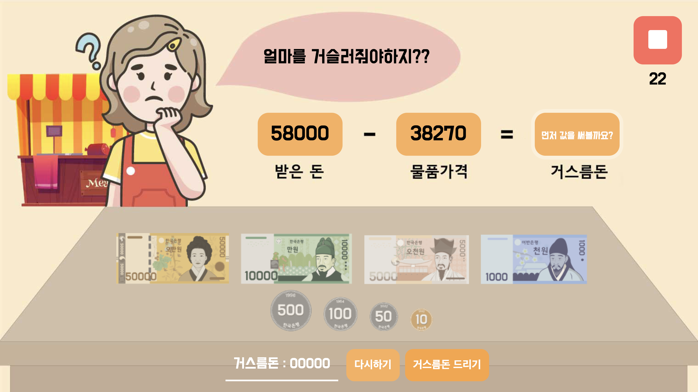

# Kmoney-Math-Game-for-kids

## 아이들을 위한 거스름돈 계산 게임 👧🧒

- https://algoroots.github.io/Kmoney-Math-Game-for-kids/

<br/>



<br/><br/>

# Introduction 🙌

> - 아이들이 스스로 물건을 구입하게 하고 얼마의 거스름 돈을 받아야할지 계산하는 과정을 재밌는 게임을 통해 수행하고, 자연스럽게 수학적 사고방식을 가질 수 있도록 도와줍니다.
>
> - 초등 3학년 과정 이상을 거친 아이들에게 적합한 게임입니다.

<br/><br/>

# SKill 🛠️

- HTML, CSS, Javascript

<br/><br/>

# 구현 기능 💻

<br/>

- [x] 게임 버튼 클릭 시 문제, 돈, 효과음이 시작되는 init() 설정
- [x] 게임 시작, 중지, 다시하기
- [x] 게임 타이머
- [x] 랜덤으로 제시되는 '받은 돈', '물품 가격' 값 제한
- [x] 게임의 단계화 (거스름돈 값 입력 후 돈을 클릭해 거스름돈을 낸다.)
- [x] 지폐, 동전 클릭시 값이 합산되어 실시간 업데이트
- [x] 거스름돈 값 리셋버튼 ('다시하기')
- [x] 결과 값 제출 시 게임 결과 팝업
- [x] 각 상황에 따른 효과음 추가

<br/><br/>

## - 주요 기능 소개

<br/>

1.  ## 거스름돈 수치 정하기

    실제로 있을 법한 가격으로 하기 위해 '받은 돈'은 100원 단위 밑으로는 0으로, 물품 가격은 1원단위만 0으로 설정하였다.
    <br/>

    ```js
    function showQuiz() {
      let n1tenThousands = Math.floor(Math.random() * (6 - 4) + 4);
      let n1thousands = Math.floor(Math.random() * 9 + 1);
      let n1hundreds = 0;
      let n1tens = 0;
      let n1ones = 0;

      let n2tenThousands = Math.floor(Math.random() * (4 - 1) + 1);
      let n2thousands = Math.floor(Math.random() * 9 + 1);
      let n2hundreds = Math.floor(Math.random() * 9 + 1);
      let n2tens = Math.floor(Math.random() * 9 + 1);
      let n2ones = 0;

      let n1 = `${n1tenThousands}${n1thousands}${n1hundreds}${n1tens}${n1ones} `;
      let n2 = `${n2tenThousands}${n2thousands}${n2hundreds}${n2tens}${n2ones} `;

      n1 = Number(n1);
      n2 = Number(n2);
      receivedPrice.value = n1;
      productPrice.value = n2;

      answer = n1 - n2;
      inputEnter();
    }
    ```

    <br/><br/>

2.  ## 게임 타이머

    게임이 시작될 때 게임 타이머가 시작된다. 시간은 'GAME_DURATION_SEC'로 지정해놓았다.
    <br/>

    ```js
    const GAME_DURATION_SEC = 30;

    function showTimer() {
      timerIndicator.style.visibility = "visible";
    }

    function startGameTimer() {
      let remainingTimeSec = GAME_DURATION_SEC;
      updateTimerText(remainingTimeSec);
      timer = setInterval(() => {
        if (remainingTimeSec <= 0) {
          clearInterval(timer);
          playSound(wrongSound);
          showPopUpWithText("시간 초과 ⏰  다시 한 번 해볼까요?");
          stopGame();
          return;
        }
        updateTimerText(--remainingTimeSec);
      }, 1000);
    }

    function stopGameTimer() {
      clearInterval(timer);
    }

    function updateTimerText(time) {
      const seconds = time % 60;
      timerIndicator.innerHTML = `${seconds}`;
    }
    ```

    <br/><br/>

3.  ## 지폐, 동전 클릭시 값이 합산되어 실시간 업데이트

    - game field 안에 넣어둔 지폐와 동전들을 target.mathces()를 활용하여 값이 클릭 될 때마다 거스름돈 값이 합산되어 업데이트 되게 구현하였다.

      ```js
      function onFieldClick(e) {
        if (!started) {
          return;
        }

        const target = e.target;

        function resultCash(valueName, cashValue) {
          if (target.matches(".Cash" + `${cashValue}`)) {
            playSound(coinSound);
            valueName.innerText = Number(valueName.innerText) + cashValue;
          }
        }

        resultCash(cashResultVal, 50000);
        resultCash(cashResultVal, 10000);
        resultCash(cashResultVal, 5000);
        resultCash(cashResultVal, 1000);
        resultCash(cashResultVal, 500);
        resultCash(cashResultVal, 100);
        resultCash(cashResultVal, 50);
        resultCash(cashResultVal, 10);
      }
      ```

    <br/> <br/>

4.  ## 거스름돈 계산 후 숫자를 넣는다.

    바로 지폐를 고르는 일은 쉽지 않다. 거스름 돈을 내기 전에 실제로 얼마를 받아야할지 생각하는 것처럼 실제 암산 후 거스름 돈을 먼저 적어본다.

    <br/>

    - 자연스럽게 거스름 돈에 값을 먼저 넣을 수 있도록 css animaation 으로 박스를 활성화

        <br/>

      ```css
        .change__value.play {
          animation: pulseInput 1s linear infinite;
        }

        @keyframes pulseInput {
          0% {
            box-shadow: 0;
          }
          50% {
            box-shadow: 0 0 0 8px rgba(255, 255, 255, 0.3);
          }
          100% {
            box-shadow: 0 0 0 8px rgba(255, 255, 255, 0.9);
          }
      ```

      <br/>

    - 거스름돈 값이 맞고 틀림에 따라 사운드와, 텍스트 표시

      - 거스름돈 값이 맞게 입력될 시에 지폐로 그 값에 맞는 값을 입력한다.
      - 상단 거스름돈 값 animation이 없어지고 지폐를 눌렀을 때마다 업데이트되는 거스름돈 값에 animation이 추가된다.

      <br/>

      ```js
      field.addEventListener("click", onFieldClick);

      function showResult() {
        if (Number(input.value) === answer) {
          returnCashCont.classList.add("play");
          input.classList.remove("play");
          playSound(correctSound);
          result("맞았어요! 이제 금액에 맞게 거스름돈을 드려볼까요? ");
        } else {
          playSound(wrongSound);
          result("음..다시 한번 계산해볼까요?");
        }
      }
      ```

    <br/> <br/>

# 향후 보안사항 📃

- [x] 리펙토링 과정을 거쳐 중복되는 것을 최대한 제거하고 js파일을 폴더별로 분리한다.
